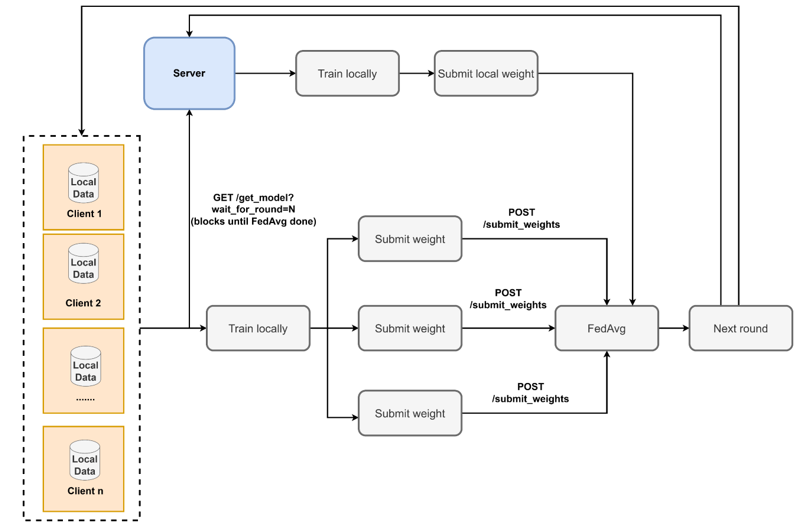

# Federated Learning — Plant Disease Detection
A federated learning setup across **3 PCs** using **weighted FedAvg** to train a
**MobileNetV2** model on the **PlantVillage** dataset (38 plant disease classes).


A federated learning setup across **3 PCs** using **weighted FedAvg** to train a
**MobileNetV2** model on the **PlantVillage** dataset (38 plant disease classes).

---

## Architecture

| File | Where it runs | Role |
|---|---|---|
| `model.py`  | All 3 PCs   | MobileNetV2 fine-tuned for 38 plant disease classes |
| `server.py` | PC 1        | Trains locally + aggregates via weighted FedAvg |
| `client.py` | PC 2 & PC 3 | Trains locally, submits weights once per round |
| `infer.py`  | Any PC      | Runs inference on the saved checkpoint |

### How a round works
1. All nodes (server + clients) **fetch the current global model** from the server.  
   `GET /get_model?wait_for_round=N` — blocks until FedAvg for round N-1 is complete.
2. Each node **trains locally** on its own data partition (no network traffic during training).
3. Each node **submits its trained weights** to the server.  
   `POST /submit_weights` — returns immediately; the caller is never blocked.
4. Once **all nodes** (server + all clients) have submitted, the server runs  
   **weighted FedAvg** — weights are averaged proportionally to each node's dataset size.
5. Round counter increments → everyone fetches the new model → repeat.

### Key design decisions

| Property | Detail |
|---|---|
| **No per-batch synchronisation** | Unlike EdgeFed, clients never wait for the server mid-epoch. The only sync point is one FedAvg per round. |
| **Server is a full participant** | Server trains on its own data partition AND runs aggregation — computation is truly shared. |
| **Auto freeze backbone on CPU** | CPU-only clients automatically freeze the MobileNetV2 backbone and only train the last 3 InvertedResidual blocks + classifier (~0.3 M params instead of 3.4 M — ~10× faster). |
| **FedAvg trigger** | FedAvg fires exactly when the last expected submission arrives (thread-safe via `threading.Condition`). |
| **Data cap per client** | Each client trains on at most `--max_samples` images (default 200). Use `--max_samples 0` to disable the cap. |

---

## Dataset — PlantVillage

38 classes covering healthy and diseased leaves across multiple plant species.

> **All 3 PCs need the dataset.** The server trains on its own partition too.

### Download (all PCs)
```cmd
pip install kaggle
python -m kaggle datasets download -d abdallahalidev/plantvillage-dataset
tar -xf plantvillage-dataset.zip
```

> **Kaggle API key required:** Go to kaggle.com → Settings → API → Create New Token.  
> Place `kaggle.json` in `C:\Users\<YourUsername>\.kaggle\kaggle.json`.

Extract so the folder structure is:
```
plantvillage/
    Apple___Apple_scab/
    Apple___Black_rot/
    Apple___Cedar_apple_rust/
    Apple___healthy/
    ...  (38 folders total)
```

Copy the `plantvillage/` folder to **each PC**.

---

## Setup (all 3 PCs)

```bash
pip install -r requirements.txt
```

Copy these files to **each PC**:
- `model.py`
- `requirements.txt`
- `server.py`  (PC 1 only)
- `client.py`  (PC 2 & PC 3 only)
- `infer.py`   (any PC you want to run inference from)

---

## Running

### PC 1 — Server

```bash
python server.py --clients 2 --rounds 10 --data_dir ./plantvillage
```

> Run as **Administrator** so the firewall rule for port 5000 is created automatically.  
> Without `--data_dir` the server runs as a **pure aggregator** (no local training).

### PC 2 — Client 1

```bash
python client.py --client_id 1 --server http://<PC1_IP>:5000 --data_dir ./plantvillage --max_samples 200
```

### PC 3 — Client 2

```bash
python client.py --client_id 2 --server http://<PC1_IP>:5000 --data_dir ./plantvillage --max_samples 200
```

> Replace `<PC1_IP>` with the actual IP of PC 1 (find it with `ipconfig`).  
> `--freeze_backbone` is **enabled automatically** on CPU-only machines.
> Each client uses at most **200 images** from its own partition by default.

---

## Optional flags

### server.py

| Flag | Default | Description |
|---|---|---|
| `--clients`     | 2    | Number of remote clients to wait for per round |
| `--rounds`      | 10   | Total FL rounds |
| `--port`        | 5000 | Listening port |
| `--lr`          | 0.001 | SGD learning rate for server local training |
| `--epochs`      | 2    | Server local training epochs per round |
| `--batch_size`  | 32   | Server training batch size |
| `--data_dir`    | —    | Server data partition (ImageFolder layout). Omit for pure aggregator. |
| `--num_classes` | 38   | Number of output classes |

### client.py

| Flag | Default | Description |
|---|---|---|
| `--client_id`       | required | Unique ID for this client (1-based, e.g. 1 or 2) |
| `--server`          | `http://localhost:5000` | Server URL |
| `--data_dir`        | required | Path to PlantVillage dataset folder |
| `--rounds`          | 10    | Number of FL rounds |
| `--epochs`          | 2     | Local training epochs per round |
| `--lr`              | 0.001 | SGD learning rate |
| `--batch_size`      | 32    | Training batch size |
| `--max_samples`     | 200   | Maximum local training images to use from this client's partition. Use `0` for all images. |
| `--num_clients`     | 2     | Total number of clients (for data partitioning) |
| `--freeze_backbone` | auto  | Freeze backbone, train only last 3 blocks + classifier. Auto-enabled on CPU. |
| `--evaluate`        | off   | Run validation accuracy after each round |
| `--num_classes`     | 38    | Number of output classes |

---

## Output

After all rounds complete, `global_model_final.pth` is saved on **PC 1** (the server).  
Copy this file (along with `model.py`) to any machine to run inference.

---

## Inference

```bash
# 10 random samples from the PlantVillage dataset
python infer.py --data_dir ./plantvillage

# 20 random samples — save annotated images (border + label) to ./results/
python infer.py --data_dir ./plantvillage --samples 20 --save --out_dir results

# One specific sample by dataset index
python infer.py --data_dir ./plantvillage --index 42

# Your own image file(s)
python infer.py --image leaf.jpg
python infer.py --image a.jpg b.jpg c.jpg

# Your own images — save annotated copies to ./results/
python infer.py --image leaf.jpg --save --out_dir results

# Different checkpoint
python infer.py --data_dir ./plantvillage --checkpoint my_model.pth
```

Output in dataset mode:

```
  Index    True Label                               Predicted                                Conf    OK
  ---------------------------------------------------------------------------------------------------------
  10423    Tomato___Late_blight                     Tomato___Late_blight                      94.3%     V
  3187     Apple___Apple_scab                       Apple___Cedar_apple_rust                  61.0%     X
  ...
  Accuracy : 9/10 (90.0%)
```

When `--save` is used, each image is annotated and saved to `--out_dir`:

- **Green border** + label bar — correct prediction  
- **Red border** + label bar — wrong prediction  
- **Blue border** + label bar — standalone `--image` file (no ground truth)

The label bar shows the disease name and confidence, e.g. `Late_blight  94.3%`.

Saved filenames encode the result:

```
3187_Apple___Apple_scab_pred-Apple___Cedar_apple_rust_WRONG_61pct.jpg
```

### infer.py flags

| Flag | Default | Description |
|---|---|---|
| `--data_dir`    | — | PlantVillage folder — picks random test samples (mutually exclusive with `--image`) |
| `--image`       | — | One or more image file paths (mutually exclusive with `--data_dir`) |
| `--samples`     | 10 | Number of random samples when using `--data_dir` |
| `--index`       | — | Predict a specific sample by dataset index instead of random |
| `--save`        | off | Save annotated images (bounding box + label bar) to `--out_dir`. Works with both `--data_dir` and `--image`. |
| `--out_dir`     | `test` | Folder to save annotated output images |
| `--checkpoint`  | `global_model_final.pth` | Path to trained model checkpoint |
| `--num_classes` | 38 | Number of output classes |

## Firewall note (Windows)

The server auto-creates a firewall rule when run as Administrator.
To add it manually:

```
Windows Defender Firewall → Inbound Rules → New Rule → Port → TCP 5000 → Allow
```

Or via PowerShell (run as Administrator):

```powershell
New-NetFirewallRule -DisplayName "FL Server" -Direction Inbound -Protocol TCP -LocalPort 5000 -Action Allow
```
```
